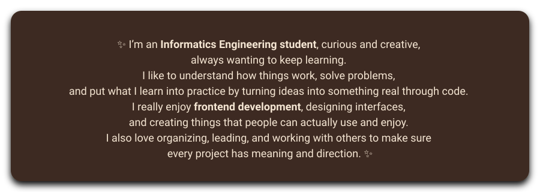

  
   
  That’s the phrase that stayed in my heart and mind when I started programming.

  

  <h2 align="center" style="color:#6F4E37;">Skills</h2>

  <h3 align="center" style="color:#4B3621;">Languages</h3>
  

     
     
     
     
     
     
  

  <h3 align="center" style="color:#4B3621;">Frontend</h3>
  

     
    
  

  <h3 align="center" style="color:#4B3621;">Tools</h3>
  

     
     
  

